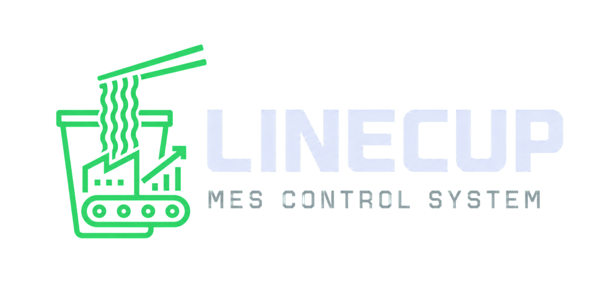
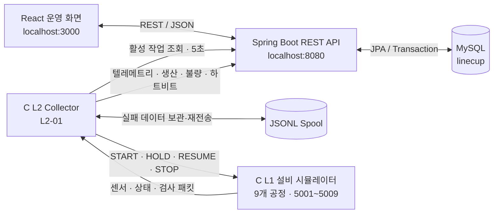
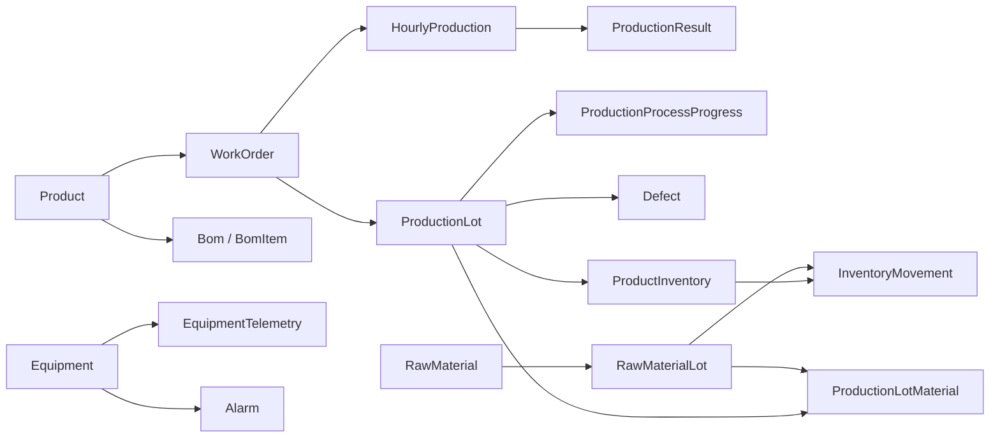

<p align="center">
  
</p>

<h1 align="center">LINECUP MES</h1>

<p align="center">
  컵라면 생산 라인의 작업지시부터 설비 통신, 생산 실적, 품질, 재고까지 연결한 MES 프로젝트
</p>

<p align="center">
  <strong>Project Status</strong> · Completed<br />
  React 19 · Spring Boot 4 · C11 · MySQL
</p>

---

## 목차

- [프로젝트 소개](#프로젝트-소개)
- [핵심 실행 흐름](#핵심-실행-흐름)
- [시스템 아키텍처](#시스템-아키텍처)
- [주요 기능](#주요-기능)
- [기술 스택](#기술-스택)
- [프로젝트 구조](#프로젝트-구조)
- [시작하기](#시작하기)
- [L1/L2 설정](#l1l2-설정)
- [데이터 및 API 계약](#데이터-및-api-계약)
- [검증 명령](#검증-명령)
- [프로젝트 범위](#프로젝트-범위)
- [상세 문서](#상세-문서)

## 프로젝트 소개

LINECUP MES는 컵라면 생산 공정을 모델링한 제조 실행 관리 시스템입니다. React 운영 화면, Spring Boot REST API, MySQL 데이터베이스, C 기반 L1 설비 시뮬레이터와 L2 수집기를 하나의 생산 흐름으로 연결했습니다.

관리자는 제품·원자재·BOM과 사용자를 관리하고, 지시자는 작업지시를 등록해 생산을 시작·보류·재개·완료할 수 있습니다. L2는 활성 작업지시를 주기적으로 조회해 9대의 L1 설비에 명령을 전달하며, L1이 생성한 설비 상태·센서·검사 데이터를 수집해 백엔드로 전송합니다. 수집된 데이터는 생산 실적, 불량, 알람, 통신 상태 화면에서 확인할 수 있습니다.

### 구현 목표

- 작업지시와 생산 LOT의 생명주기를 일관된 상태 전이로 관리
- 9개 제조 공정의 L1/L2 TCP 통신과 백엔드 HTTP 연동 구현
- 생산·품질·재고·알람 데이터를 하나의 업무 흐름으로 추적
- 재전송에도 중복 집계되지 않는 멱등 API와 JSONL 스풀 구성
- 운영 화면의 검색, 필터, 페이징, 통계 및 상태별 시각화 제공

## 핵심 실행 흐름

1. 지시자가 제품, 목표 수량, 담당자와 설비를 선택해 작업지시를 등록합니다. 생산 LOT는 같은 트랜잭션에서 자동 생성됩니다.
2. 작업지시가 시작되면 L2가 활성 작업을 조회하고 선택된 L1 설비에 `START` 명령을 보냅니다. 보류·재개·완료 상태는 각각 `HOLD`, `RESUME`, `STOP` 명령으로 전달됩니다.
3. L1은 설비별 센서·상태·검사 패킷을 L2로 보내고, L2는 텔레메트리 배치, 생산 집계, 불량, 통신 하트비트를 REST API로 전송합니다.
4. 백엔드는 생산수량과 LOT·공정 진행률을 집계하고, 임계 범위를 벗어난 텔레메트리로 알람을 생성하며, 재고 이동과 품질 처리 이력을 트랜잭션으로 보존합니다.
5. React 화면은 데이터 성격에 따라 5초, 30초 또는 60초 주기로 API를 조회해 최신 집계 상태를 표시합니다.

## 시스템 아키텍처



### L1 설비 구성

L1은 하나의 프로세스에서 9개 설비 스레드를 실행하며, 각 설비는 독립된 TCP 포트를 사용합니다.

| 순서 | 공정 | 설비 코드 | 기본 포트 |
| ---: | --- | --- | ---: |
| 1 | 혼합 | `MIXER-01` | 5001 |
| 2 | 압연 | `ROLLER-01` | 5002 |
| 3 | 제면 | `NOODLE-01` | 5003 |
| 4 | 증숙 | `STEAMER-01` | 5004 |
| 5 | 절단 | `CUTTER-01` | 5005 |
| 6 | 유탕 | `FRYER-01` | 5006 |
| 7 | 냉각 | `COOLER-01` | 5007 |
| 8 | 포장 | `PACKER-01` | 5008 |
| 9 | 검사 | `INSPECTOR-01` | 5009 |

## 주요 기능

| 영역 | 구현 내용 |
| --- | --- |
| 대시보드 | 오늘 생산량과 달성률, 진행·보류 작업, 현재 알람, L1/L2 연결 상태, 공정 파이프라인과 최근 추이 조회 |
| 작업지시 | 목록·차트·상세 조회, 등록, 목표 수량 수정, 지시자·작업자·설비 배정, 시작·보류·재개·완료 및 상태 이력 관리 |
| 생산 실적 | 작업지시·제품별 생산/정상/불량 수량, 시간별 집계, 기간별 생산 추이와 목표 달성률 분석 |
| 품질관리 | 불량 대시보드, 검색·상세·등록, 원인 및 처리 방법 관리, 일별·제품별·공정별·유형별 통계 |
| 기준정보·BOM | 제품·원자재 등록 및 수정, 공정 조회, 제품별 BOM 버전과 원자재 소요량 관리 |
| LOT·재고 | 원자재 LOT 입고, 생산 LOT별 자재 투입·취소, 완제품 입고, 입출고·조정 이력과 안전재고 상태 관리 |
| 알람 | 현재·이력·상세 조회, 처리 상태 변경, 설비별·심각도별 현황, 기간별 통계와 빈발 알람 분석 |
| 통신 상태 | 9개 L1 연결 상태와 마지막 수신 시각, L2 수집기 하트비트, 송수신 성공·실패 로그 조회 |
| 계정·설정 | 회원가입, 로그인, 사원번호 찾기, 비밀번호 재설정, 가입 승인, 사용자 역할·활성 상태, 작업자 프로필·보유 기술 관리 |

## 기술 스택

| 구분 | 기술 |
| --- | --- |
| Frontend | React 19.2.7, React Router 7.18.1, TanStack Query 5.101.2, Styled Components 6.4.3, Recharts 3.9.2, Axios, React Hook Form, Yup |
| Backend | Java 17, Spring Boot 4.0.7, Spring Web MVC, Spring Data JPA, Bean Validation, Gradle |
| Database | MySQL, Hibernate ORM, UTC 기반 시각 저장 |
| L1/L2 | C11, POSIX Socket, pthread, libcurl, cJSON, JSONL spool |
| Protocol | HTTP/JSON REST API, 고정 길이 TCP 패킷 |
| Test | JUnit, Mockito, React Testing Library, C unit test, Python integration smoke test |

## 프로젝트 구조

```text
human_final_proj/
├── backend/                    # Spring Boot API와 도메인 로직
│   ├── src/main/java/com/human/linecup/
│   │   ├── controller/         # REST API
│   │   ├── dto/                # 요청·응답 record
│   │   ├── entity/             # 30개 JPA Entity와 도메인 규칙
│   │   ├── repository/         # 조회, 잠금, 멱등성 저장 계약
│   │   └── service/            # 트랜잭션과 상태 전이
│   └── src/main/resources/     # 실행 설정과 기준 데이터
├── frontend/                   # React 운영 화면
│   └── src/
│       ├── api/                # Axios API 모듈
│       ├── components/         # 공통 UI와 내비게이션
│       ├── hooks/              # Query와 화면 공통 로직
│       └── pages/              # 업무 영역별 화면
├── c/
│   ├── common/                 # 공통 프로토콜, 네트워크, 타입
│   ├── l1/                     # 9개 설비 시뮬레이터
│   ├── l2/                     # 수집, 명령 폴링, 집계, API, 스풀
│   ├── runtime/                # 미전송 JSONL 데이터
│   └── tests/                  # C 단위·통합 테스트
├── docs/API_SPEC.md            # React ↔ Backend API 계약
├── DESIGN.md                   # UI 디자인 시스템
└── README.md
```

## 시작하기

### 1. 사전 요구사항

- Java 17
- MySQL
- Node.js와 Yarn
- GCC, Make, pkg-config
- libcurl, cJSON 개발 패키지

Ubuntu/WSL에서 C 빌드 의존성은 다음과 같이 설치할 수 있습니다.

```bash
sudo apt update
sudo apt install build-essential pkg-config libcurl4-openssl-dev libcjson-dev
```

### 2. 저장소 내려받기

```bash
git clone https://github.com/human-final-team-20260709/LineCup.git
cd LineCup
```

### 3. MySQL 개발 DB 생성

기본 개발 설정은 `127.0.0.1:3306`, 데이터베이스 `linecup`, 사용자 `linecup_app`을 사용합니다.

```sql
CREATE DATABASE linecup
  CHARACTER SET utf8mb4
  COLLATE utf8mb4_unicode_ci;

CREATE USER IF NOT EXISTS 'linecup_app'@'localhost'
  IDENTIFIED BY '1234';

GRANT ALL PRIVILEGES ON linecup.* TO 'linecup_app'@'localhost';
FLUSH PRIVILEGES;
```

다른 접속 정보를 사용할 경우 [`application.properties`](./backend/src/main/resources/application.properties)를 개발 환경에 맞게 변경합니다. 저장소의 계정 정보는 로컬 개발용이며 운영 환경에서는 환경별 비밀값으로 분리해야 합니다.

### 4. 최초 스키마와 기준 데이터 생성

최초 한 번만 `schema-reset` 프로필로 실행해 30개 테이블과 9개 공정·설비, 불량 유형 기준 데이터를 생성합니다.

```bash
cd backend
SPRING_PROFILES_ACTIVE=schema-reset bash gradlew bootRun
```

`Started LinecupApplication` 로그를 확인한 뒤 `Ctrl+C`로 종료합니다.

> **주의:** `schema-reset`은 `ddl-auto=create`를 사용하므로 실행할 때마다 기존 테이블과 데이터를 다시 생성합니다. 초기화 이후의 일반 실행에는 이 프로필을 사용하지 마세요.

### 5. 전체 시스템 실행

각 명령은 별도의 터미널에서 프로젝트 루트를 기준으로 실행합니다.

#### Terminal 1 — Backend

```bash
cd backend
bash gradlew bootRun
```

#### Terminal 2 — L1 설비 시뮬레이터

```bash
cd c
make l1
./mes_l1
```

#### Terminal 3 — L2 수집기

```bash
cd c
make l2
./mes_l2
```

#### Terminal 4 — Frontend

```bash
cd frontend
yarn install
yarn start
```

브라우저에서 [http://localhost:3000](http://localhost:3000)에 접속합니다. 개발 서버는 `/api` 요청을 `http://localhost:8080`으로 프록시합니다.

권장 실행 순서는 **MySQL → Backend → L1 → L2 → Frontend**입니다. L1/L2 없이도 기준정보와 사용자 화면은 확인할 수 있지만, 설비 통신과 생산 데이터 수집을 포함한 전체 흐름에는 두 C 프로세스가 모두 필요합니다.

### 6. 최초 로그인 계정 준비

초기 데이터에는 사용자 계정이 포함되지 않습니다. 화면에서 관리자 계정으로 회원가입한 뒤, 최초 계정에 한해 MySQL에서 승인·활성 상태로 변경합니다.

```sql
UPDATE app_user
SET approval_status = 'APPROVED', is_active = TRUE
WHERE emp_no = '가입한 사원 번호';
```

이후에는 관리자 화면의 **설정 → 가입 승인 대기**에서 다른 계정을 승인할 수 있습니다.

## L1/L2 설정

실행 환경 변수로 C 프로그램의 기본값을 변경할 수 있습니다. 값을 지정하지 않으면 아래 기본값을 사용합니다.

| 환경 변수 | 적용 | 기본값 | 설명 |
| --- | --- | --- | --- |
| `MES_BASE_URL` | L2 | `http://localhost:8080` | 백엔드 주소 |
| `MES_COLLECTOR_CODE` | L2 | `L2-01` | 수집기 코드 |
| `MES_L1_HOST` | L2 | `127.0.0.1` | L1 접속 주소 |
| `MES_BASE_PORT` | L1/L2 | `5001` | 첫 설비 포트, 이후 9개 연속 사용 |
| `MES_COMMAND_POLL_MS` | L2 | `5000` | 활성 작업지시 조회 주기 |
| `MES_TELEMETRY_BATCH_MS` | L2 | `10000` | 텔레메트리 배치·하트비트 전송 주기 |
| `MES_PRODUCTION_SYNC_MS` | L2 | `10000` | 진행 중 생산 스냅샷 동기화 주기 |
| `MES_AGGREGATION_SECONDS` | L2 | `3600` | 생산 집계 버킷 길이 |
| `MES_SPOOL_PATH` | L2 | `runtime/pending.jsonl` | 전송 대기 데이터 저장 경로 |
| `MES_SENSOR_INTERVAL_MS` | L1 | `1000` | 센서·상태 패킷 생성 주기 |
| `MES_INSPECTION_INTERVAL_MS` | L1 | `5000` | 검사 결과 생성 주기 |
| `MES_DEFECT_RATE_PERCENT` | L1 | `5` | 검사 불량 생성 비율 |
| `MES_TELEMETRY_ALARM_RATE_PER_10000` | L1 | `15` | 임계 범위 텔레메트리 생성 비율 |
| `MES_RANDOM_SEED` | L1 | 현재 시각 | 재현 가능한 시뮬레이션 난수 시드 |

예를 들어 생산 집계 버킷을 1분으로 줄여 통합 흐름을 확인하려면 다음과 같이 L2를 실행합니다.

```bash
cd c
MES_AGGREGATION_SECONDS=60 ./mes_l2
```

## 데이터 및 API 계약

### 핵심 데이터 관계



- 모든 이벤트 시각은 UTC ISO-8601 `Instant`로 저장하고, 업무 날짜와 화면 통계 경계는 `Asia/Seoul` 기준으로 처리합니다.
- 생산수량은 L2가 전송한 집계값의 합계이며 `productionQty = goodQty + defectQty` 규칙을 유지합니다.
- 시간별 생산은 `(workOrderId, bucketStart)`, 불량 수집은 `idempotencyKey`로 중복 저장을 방지합니다.
- 원자재·완제품 수량 변경은 `InventoryMovement`와 같은 트랜잭션에서 처리합니다.
- 목록 API는 Spring `Page` 구조를 사용하고, 오류 응답은 RFC 9457 `ProblemDetail` 형식으로 통일합니다.

### L2 연동 API

| Method | Path | 역할 |
| --- | --- | --- |
| `GET` | `/api/l2/work-orders/active` | 수집기별 활성 작업과 대상 설비 조회 |
| `POST` | `/api/l2/telemetry/batch` | 센서 텔레메트리 일괄 저장 |
| `POST` | `/api/l2/hourly-productions` | 진행 스냅샷과 종료 생산 집계 저장 |
| `POST` | `/api/l2/defects` | 검사 불량 멱등 저장 |
| `POST` | `/api/l2/status/heartbeat` | L2와 연결된 L1 상태 갱신 |

## 검증 명령

### Backend

```bash
cd backend
bash gradlew clean test
```

### Frontend

```bash
cd frontend
CI=true yarn test --watchAll=false
yarn build
```

### L1/L2

```bash
cd c
make clean all test
make integration-test
```

`integration-test`는 Python mock backend와 테스트용 포트를 사용해 L1 → L2 → HTTP 전송 흐름을 확인합니다.

## 프로젝트 범위

- 이 프로젝트의 L1은 실제 PLC가 아닌 C 기반 설비 시뮬레이터입니다.
- 화면 데이터는 업무 성격에 따라 주기적으로 다시 조회합니다. 생산수량은 L2 집계 시점에 반영되므로 모든 값이 초 단위로 갱신되는 구조는 아닙니다.
- 로그인 정보는 브라우저 `sessionStorage`에 보관하는 데모 인증입니다. 역할별 메뉴 노출은 구현되어 있지만 세션/JWT, 백엔드 엔드포인트 권한 강제, 일회성 비밀번호 재설정 토큰은 포함하지 않습니다.
- 기본 구성은 로컬 개발 환경을 대상으로 하며, 운영 배포를 위해서는 비밀값 분리, 인증·인가, HTTPS, CORS, 모니터링 구성이 추가로 필요합니다.

## 상세 문서

- [Frontend ↔ Backend API 명세](./docs/API_SPEC.md)
- [Backend Entity/DTO 및 L2 계약](./backend/README.md)
- [UI 디자인 시스템](./DESIGN.md)
- [Frontend 실행 스크립트](./frontend/README.md)
