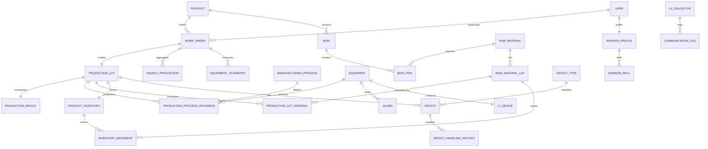

# Backend Entity/DTO Contract

이 문서는 현재 백엔드 Entity와 DTO의 기준 문서다. 프론트 화면의 표시값은 조회 DTO에서 조합하고, C가 보내는 JSON 형식은 아래 L2 계약을 그대로 유지한다.

## 패키지 규칙

```text
com.human.linecup
├── entity/          # JPA Entity, enum, 도메인 불변식
├── repository/      # 조회 그래프, 멱등 키, 잠금 쿼리
├── service/         # 트랜잭션, 상태 전이, DTO 매핑
└── dto/
    ├── request/     # 요청 record
    └── response/    # 응답 record
```

- DTO 하위에 도메인별 추가 패키지를 만들지 않는다.
- DTO는 모두 불변 `record`이며 Entity를 생성하거나 조회하지 않는다.
- Entity는 공개 setter 없이 정적 팩터리와 의미 있는 변경 메서드만 제공한다.
- 테이블과 컬럼은 소문자 `snake_case`를 사용한다. 사용자 테이블은 예약어 충돌을 피하기 위해 `app_user`를 사용한다.
- 이벤트 시각은 UTC ISO-8601 `Instant`, 업무 날짜는 `LocalDate`를 사용한다.
- 숫자 PK와 업무 식별자를 구분한다. 예: `userId`/`empNo`, `productId`/`productCode`.
- 요청 상태는 enum 코드로 받고 응답에는 코드와 `...Label`을 함께 제공한다.
- 작업지시 상태는 `PENDING / IN_PROGRESS / HOLD / DONE`을 사용하며 화면에는 `PENDING`을 "대기"로 표시한다.
- 생산 LOT는 작업지시 등록 트랜잭션에서 하나만 자동 생성하며, 작업지시와 같은 트랜잭션에서 시작·보류·재개·완료한다.
- 기간 조회는 UTC `Instant`의 반개구간 `[from, to)`를 사용하고 시작·종료 시각을 함께 받는다.
- 검증 실패·미존재·상태 충돌·내부 오류는 각각 400·404·409·500 `ProblemDetail`로 반환한다.

## L2 HTTP DTO 계약

| 경로 | 메서드 | DTO | 처리 규칙 |
| --- | --- | --- | --- |
| `/api/l2/work-orders/active?collectorCode=...` | GET | `L2ActiveWorkOrderResponse` | 활성 작업 없음 `204`, 있으면 `200`; `equipmentCodes`는 비어 있을 수 없음 |
| `/api/l2/telemetry/batch` | POST | `TelemetryBatchRequest` | `samples` 1개 이상, metric은 `TEMPERATURE/HUMIDITY/SPEED` |
| `/api/l2/hourly-productions` | POST | `HourlyProductionRequest` | `(workOrderId, bucketStart)` 기준 멱등 갱신 |
| `/api/l2/defects` | POST | `DefectIngestRequest` | `idempotencyKey` 기준 중복 저장 방지 |
| `/api/l2/status/heartbeat` | POST | `L2HeartbeatRequest` | `connectedL1Count`와 연결 장비 수가 일치해야 함 |

`L2ActiveWorkOrderResponse`는 `workOrderId`, `productionLotId`, `status`, `targetQty`, `currentQty`, `hourlyTargetQty`, `equipmentCodes`를 모두 제공한다. 모든 POST는 저장이 완료된 뒤에만 2xx를 반환해야 C의 JSONL 스풀에서 안전하게 제거된다.

L2 상태 조회는 `mes.l2.stale-after`(기본 30초) 동안 하트비트가 없으면 저장값과 별개로 `STOPPED`/`DISCONNECTED` 상태를 반환한다.

## 기준정보 API

| 경로 | 설명 |
| --- | --- |
| `GET /api/products`, `GET /api/products/{productId}` | 제품 검색·상세 |
| `POST /api/products`, `PUT /api/products/{productId}` | 제품 등록·수정 |
| `GET /api/raw-materials`, `GET /api/raw-materials/{materialId}` | 원자재 검색·상세 |
| `POST /api/raw-materials`, `PUT /api/raw-materials/{materialId}` | 원자재 등록·수정 |
| `GET /api/manufacturing-processes?activeOnly=true`, `GET /api/manufacturing-processes/{processId}` | 공정 목록·상세 |

제품과 원자재는 삭제하지 않고 `INACTIVE` 상태로 변경하여 과거 BOM·작업지시 참조를 보존한다.

## 논리 ERD



### 핵심 테이블과 제약

- `equipment_telemetry`: 기존 온도·습도·속도 테이블을 통합한다. 설비/metric/시각 및 작업지시/시각 인덱스를 둔다.
- `hourly_production`: `(work_order_id, bucket_start)` 유일 키와 `production_qty = good_qty + defect_qty` 제약을 둔다.
- `defect`: `defect_no`, `idempotency_key`가 각각 유일하며 LOT·설비·불량 유형을 FK로 참조한다.
- `bom`/`bom_item`: BOM 헤더 버전과 원자재 행을 분리한다. `(product_id, version)` 및 `bom_code`가 유일하다.
- `inventory_movement`: 원자재 LOT 또는 완제품 재고 중 정확히 하나만 참조한다.
- `production_lot`: `work_order_id`가 유일하며 LOT 번호는 작업지시 번호의 `WO-`를 `LOT-`로 치환해 생성한다.
- `production_process_progress`: `(production_lot_id, process_id)`가 유일하다.
- `raw_material_lot`: 내부 `material_lot_no`와 공급사 LOT 번호를 구분한다.

## 수량 소유권

| 단계 | 책임 |
| --- | --- |
| `HourlyProduction` | L2가 전송한 시간 버킷 원천 |
| `ProductionResult` | 생산 LOT별 시간 집계 요약 |
| `ProductionLot` | LOT 현재 합계 |
| `WorkOrder` | 작업지시 전체 합계 |

각 단계의 저장 필드는 의도적인 집계 스냅샷이다. 모든 갱신은 `production/currentQty = goodQty + defectQty`와 음수 금지 규칙을 적용하고, 비율은 `ProductionQuantityPolicy`의 한 자리 반올림 규칙을 사용한다.

생산수량은 `HourlyProductionService` 집계만 변경한다. 원자재·완제품 현재고는 직접 수정하지 않으며, 최초 입고·생산 투입·투입 취소·일반 입출고/조정을 모두 `InventoryMovement`와 같은 트랜잭션에서 반영한다.

- `POST /api/raw-material-lots`는 `handledById`를 받고 최초 `INBOUND` 이동을 생성한다.
- `POST /api/product-inventories`는 완료 LOT의 `goodQty`를 최초 수량으로 사용하고 `handledById`의 `INBOUND` 이동을 생성한다.
- `POST /api/production-lots/{productionLotId}/materials`는 원자재 `OUTBOUND` 이동을 생성한다.
- `POST /api/production-lots/{productionLotId}/materials/{materialLotId}/reversal`은 담당자와 사유를 받아 역방향 `INBOUND` 이동을 생성한다.

## 인증 범위

현재 인증 API는 데모용이다. 로그인 실패는 401, 미승인·비활성 계정은 403으로 구분하지만 세션/JWT, 엔드포인트 권한 강제, 일회성 비밀번호 재설정 토큰은 제공하지 않는다. 운영 환경의 인증·인가 수단으로 사용해서는 안 된다.

## 초기 기준 데이터

`data.sql`은 C가 보내는 불량 코드와 9개 표준 공정·설비(`MIXER-01`~`INSPECTOR-01`)를 등록한다. 설비 코드는 물리 설비 계약이고 공정의 `sequence_no`는 화면 표시 순서일 뿐 설비 간 선후 의존성을 만들지 않는다. 개발 DB를 실제로 초기화할 때만 `schema-reset` 프로필을 활성화한다. 이 프로필은 `ddl-auto=create`이므로 기존 개발 데이터가 삭제된다.

```bash
SPRING_PROFILES_ACTIVE=schema-reset bash gradlew bootRun
```

## 검증

```bash
bash gradlew clean compileJava
```
